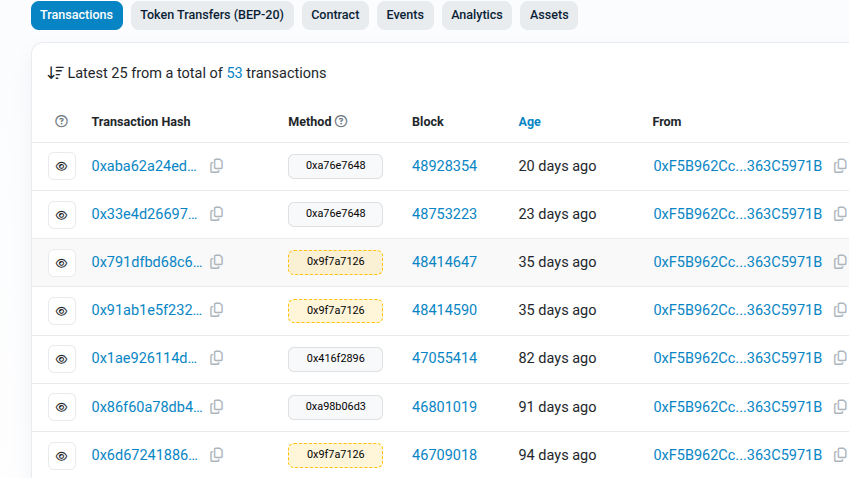
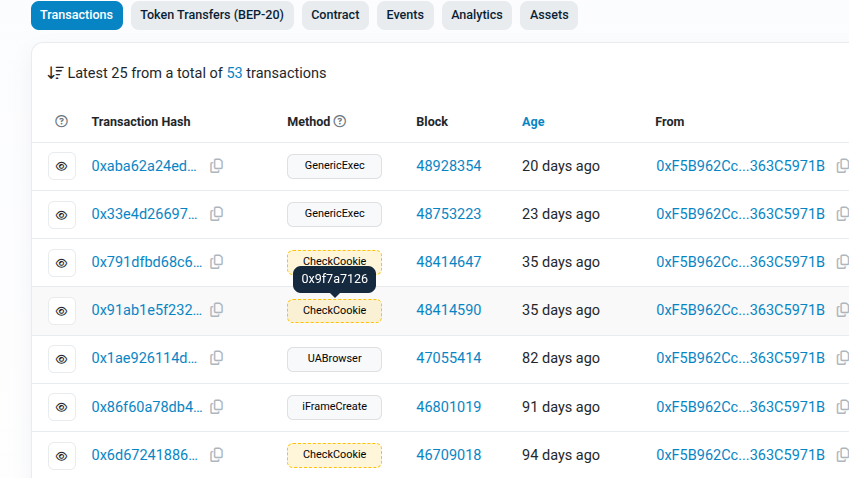
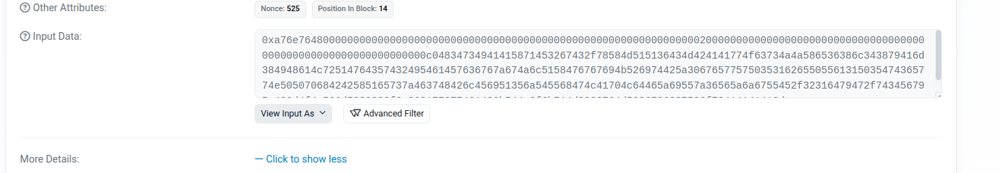
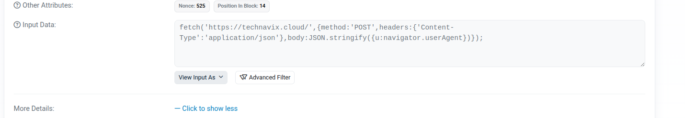

# Clearfake binance Plugin

## Caution
This plugin uses 3th party code, not written by me in pako.min.js. This is used to decompress gzipped payloads.

## Introduction
The goal of the plugin is to help you analyze malicious smart contracts on binance (such as those mentioned in this [blog](https://blog.sekoia.io/clearfakes-new-widespread-variant-increased-web3-exploitation-for-malware-delivery/)). It assists with to actions. 
One can Map already known functions to a meaningfull name, so you can quickly see, which methods were used last (or in this case, which payload was updated last).
The second action is for decoding the payload. This contract uses Base64 and gziped payload and it is easier to just click the decode button, than to copy the payload to Cyberchef or another 3th party tool. 

### Map Functions
This action "renames" the functions of a binance contract, so you don't need to remember obscure hex values. 
Just add new mappings to popup.js

Before: 

After:

### Decode 
This function tries to decode the Payload (argument), that was provided to a function. 
Atm it tries to base64/gzip decompress if it finds the gzip header. If not it will do nothing. 

Before:

After: 

